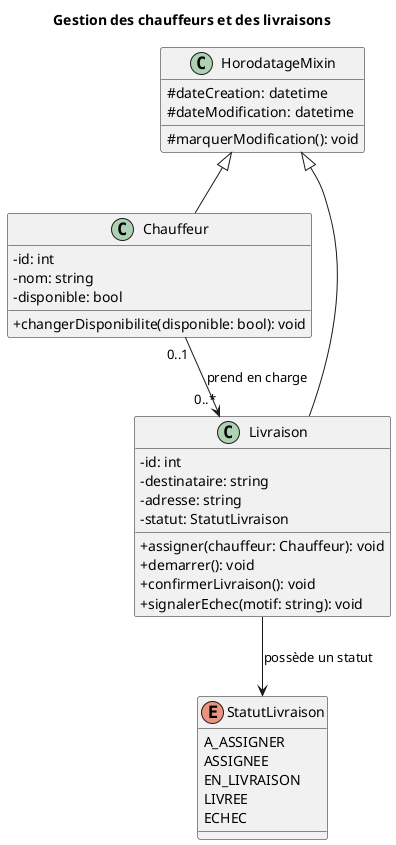

# Diagramme de classes initial

```plantuml
@startuml
skinparam classAttributeIconSize 0
title Gestion des chauffeurs et des livraisons

class HorodatageMixin {
  # dateCreation: datetime
  # dateModification: datetime
  # marquerModification(): void
}

class Chauffeur {
  - id: int
  - nom: string
  - disponible: bool
  + changerDisponibilite(disponible: bool): void
}

class Livraison {
  - id: int
  - destinataire: string
  - adresse: string
  - statut: StatutLivraison
  + assigner(chauffeur: Chauffeur): void
  + demarrer(): void
  + confirmerLivraison(): void
  + signalerEchec(motif: string): void
}

enum StatutLivraison {
  A_ASSIGNER
  ASSIGNEE
  EN_LIVRAISON
  LIVREE
  ECHEC
}

HorodatageMixin <|-- Chauffeur
HorodatageMixin <|-- Livraison
Chauffeur "0..1" --> "0..*" Livraison : prend en charge
Livraison --> StatutLivraison : possède un statut

@enduml
```