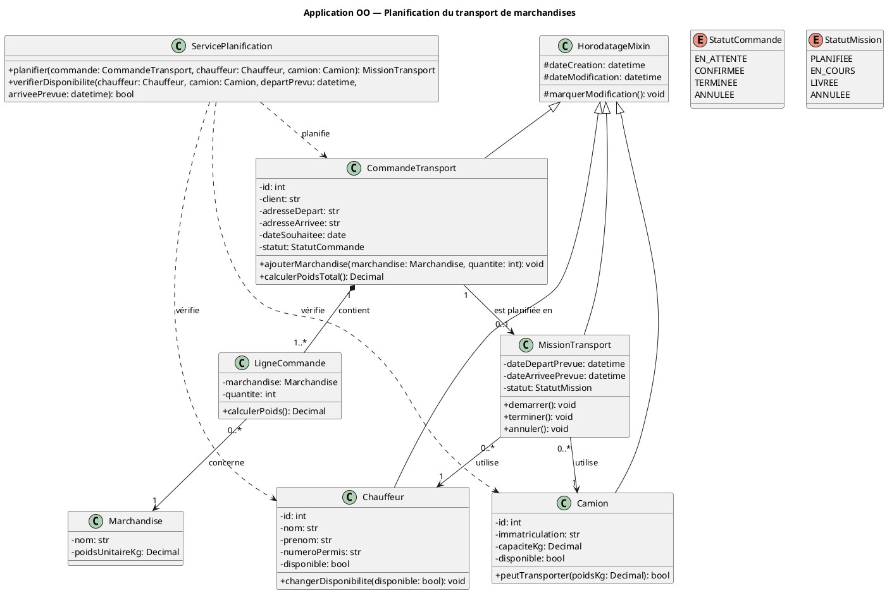

# Diagramme de classes initial — Application OO de gestion du transport

```plantuml
@startuml
skinparam classAttributeIconSize 0
title Application OO — Planification du transport de marchandises

class HorodatageMixin {
  # dateCreation: datetime
  # dateModification: datetime
  # marquerModification(): void
}

class Chauffeur {
  - id: int
  - nom: str
  - prenom: str
  - numeroPermis: str
  - disponible: bool
  + changerDisponibilite(disponible: bool): void
}

class Camion {
  - id: int
  - immatriculation: str
  - capaciteKg: Decimal
  - disponible: bool
  + peutTransporter(poidsKg: Decimal): bool
}

class CommandeTransport {
  - id: int
  - client: str
  - adresseDepart: str
  - adresseArrivee: str
  - dateSouhaitee: date
  - statut: StatutCommande
  + ajouterMarchandise(marchandise: Marchandise, quantite: int): void
  + calculerPoidsTotal(): Decimal
}

class Marchandise {
  - nom: str
  - poidsUnitaireKg: Decimal
}

class LigneCommande {
  - marchandise: Marchandise
  - quantite: int
  + calculerPoids(): Decimal
}

class MissionTransport {
  - dateDepartPrevue: datetime
  - dateArriveePrevue: datetime
  - statut: StatutMission
  + demarrer(): void
  + terminer(): void
  + annuler(): void
}

class ServicePlanification {
  + planifier(commande: CommandeTransport, chauffeur: Chauffeur, camion: Camion): MissionTransport
  +verifierDisponibilite(chauffeur: Chauffeur, camion: Camion, departPrevu: datetime, 
  arriveePrevue: datetime): bool
}

enum StatutCommande {
  EN_ATTENTE
  CONFIRMEE
  TERMINEE
  ANNULEE
}

enum StatutMission {
  PLANIFIEE
  EN_COURS
  LIVREE
  ANNULEE
}

HorodatageMixin <|-- Chauffeur
HorodatageMixin <|-- Camion
HorodatageMixin <|-- CommandeTransport
HorodatageMixin <|-- MissionTransport

CommandeTransport "1" *-- "1..*" LigneCommande : contient
LigneCommande "0..*" --> "1" Marchandise : concerne
CommandeTransport "1" --> "0..1" MissionTransport : est planifiée en
MissionTransport "0..*" --> "1" Chauffeur : utilise
MissionTransport "0..*" --> "1" Camion : utilise
ServicePlanification ..> CommandeTransport : planifie
ServicePlanification ..> Chauffeur : vérifie
ServicePlanification ..> Camion : vérifie

@enduml
```